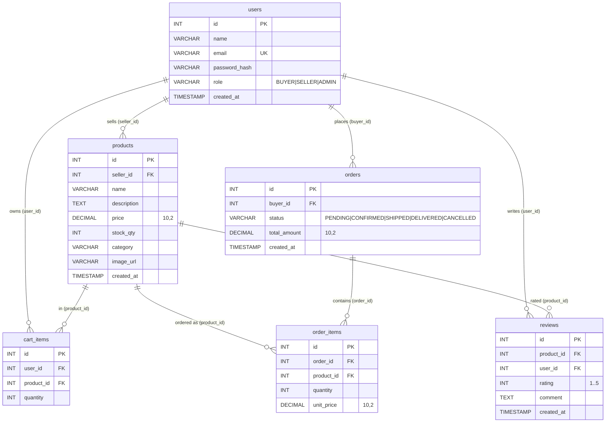

# Database — ER Diagram (ARTHY MART)

## Notes
- Money uses `DECIMAL(10,2)` (`price`, `unit_price`, `total_amount`).
- `users.email` is UNIQUE.
- `cart_items(user_id, product_id)` is UNIQUE (one row per product per user).
- `reviews(product_id, user_id)` is UNIQUE (one review per purchase per product).
- All FKs use `ON DELETE CASCADE`.
- Indexes on `products(seller_id, category)`, `orders(buyer_id)`, `order_items(order_id, product_id)`, `cart_items(user_id)`, `reviews(product_id)`.
- Source of truth: `src/main/resources/db/schema.sql` (runtime) and `db/migrations/V1_init_schema.sql` (reference).
