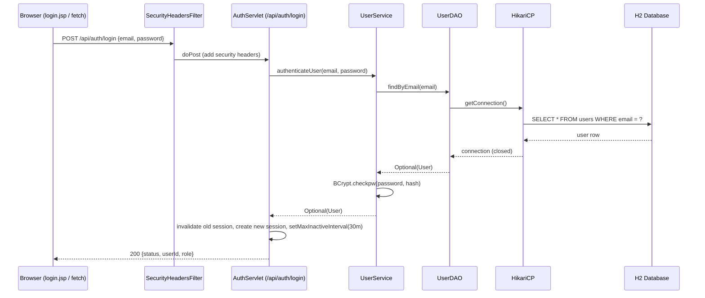
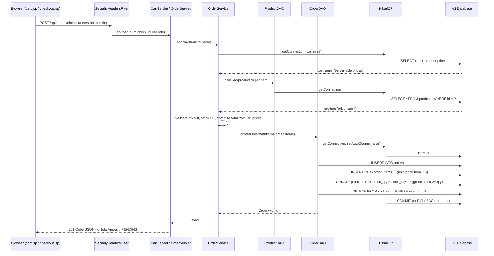
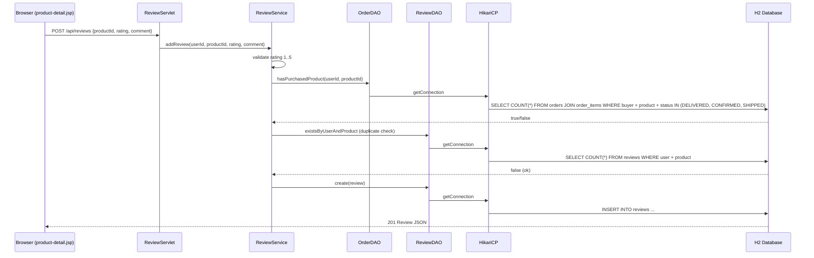

# Sequence Diagram (ARTHY MART)

Layered flow: Browser → Filter → Servlet / Front Controller → Service → DAO → HikariCP → H2 → Response.

## 1. Login (F1)

## 2. Checkout (F4 → F5)

## 3. Review (F8)

