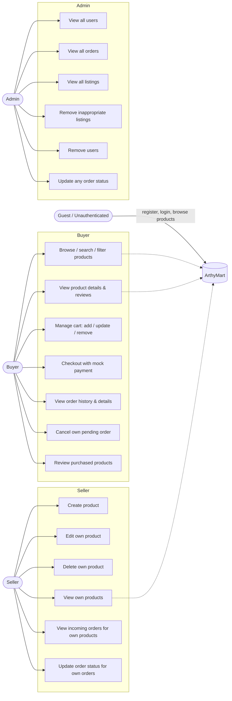

# Use Case Diagram (ARTHY MART)

## Authorization matrix
| Endpoint | Guest | Buyer | Seller | Admin |
|---|---|---|---|---|
| POST /api/auth/register (BUYER/SELLER) | yes | yes | yes | yes |
| POST /api/auth/register (ADMIN) | no | no | no | yes |
| GET /api/products | yes | yes | yes | yes |
| POST/PUT/DELETE /api/products | no | no | own only | yes (moderate) |
| /api/cart, POST /api/orders, /api/orders/checkout | no | yes | no | no* |
| GET /api/orders (own) | no | yes | yes (own buyer orders + ?view=seller) | yes |
| PUT /api/orders/{id} | no | cancel own pending | own-product orders | any |
| POST /api/reviews | no | purchased only | no | no |
| /api/admin/* | no | no | no | yes |

\* Admin can place orders only if explicitly acting as buyer; sellers use buyer accounts for purchases in tests.
